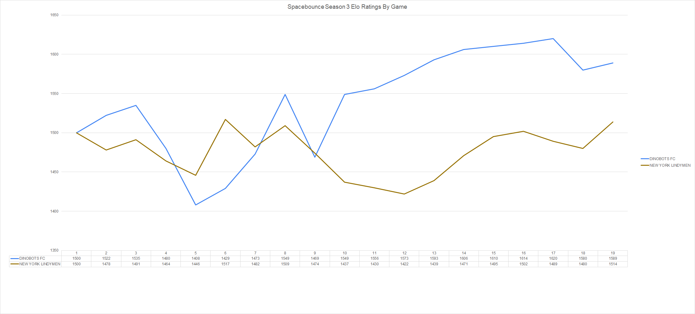

# elo-ssn3

## A Tale of Two Seasons
DINOBOTS FC vs NEW YORK LINDYMEN
> DINOBOTS FC: Season Low: 1408, Season High: 1620, Final: 1589  
> NEW YORK LINDYMEN: Season Low: 1422, Season High: 1517, Final: 1514

Surprisingly, and not evident by the final standings, the Dinobots and the Lindymen actually follow a very similar trajectory. Although the Dinobots reached a much higher season-high rating, their final ratings are not as far apart, and New York actually had a higher minimum rating. The Lindymen started the season with a close 2-goal loss to the Dinobots, and their ratings followed closely until they began to diverge after game 9. The Lindymen suffered a bad loss to the Hotdoges while the Dinobots crushed the Tigers. Then, in their chance to recover, the Lindymen lost game 10 to the Dinobots by 1 goal in OT, seemingly the nail in the coffin. The Lindymen tried to right the ship and ended up with the highest Elo rating of all non-playoff teams by far, even higher than some playoff teams, but the damage had already been done. If New York had won even 1 of the extremely close games against the Dinobots, the playoffs might've had a vastly different outcome.

__The Heartbreaker and the Comeback__
FLYING QUACKHEADS vs VADERS VENGEANCE

FLYING QUACKHEADS: Season Low: 1368, Season High: 1590, Final: 1368
VADERS VENGEANCE: Season Low: 1407, Season High: 1566, Final: 1542

You might not know it but the Quackheads got to one of the hottest starts in the league. In game 6, the Quackheads defeated the Hotdoges by 6 goals and reached the highest rating in the league at the time. Unfortunately, they followed that performance by a similar 5-goal thrashing by the Dinobots and could never seem to recover. Save for one impressive win against the Tigers game 12, the Quackheads just could not get it together and were left wondering what could've been. On the other hand, the Vaders had arguably the worst start to the season, having the lowest Elo in the league before game 4 and again after game 8. However, the Vaders turned it around with a decisive 6-goal win against 7-Up and never looked back. They finished with the 3rd highest Elo rating and nearly broke through in the playoffs.

__The Middle of the Pack__
7-UP vs TSUROSAME

7-UP: Season Low: 1444, Season High: 1571, Final: 1492
TSUROSAME: Season Low: 1432, Season High: 1533, Final: 1453

These two teams jostled for position as the last team in the playoffs for the entire season. Although Tsurosame got to a slightly better start than 7-Up, the teams switched positions after two quality wins by 7-Up against the Quackheads and Cheyenne and two bad losses by Tsurosame against Frankfurt and the Dinobots. These were teams that could sneak in a win against a top team but still remained firmly in the middle of the pack.

__The Biggest Upset__
CHEYENNE CZAICZAISH vs ISTANBUL TIGERS

CHEYENNE CZAICZAISH: Season Low: 1444, Season High: 1571, Final: 1492
ISTANBUL TIGERS: Season Low: 1374, Season High: 1545, Final: 1464

These teams both had very up-and-down seasons. Prior to their game-13 matchup, Cheyenne was coming off of a 5-game win streak including a 9-goal win over the Dinobots, while the Tigers had just experienced a 4-game slide starting with a league-high 11-goal loss, again against the Dinobots. This meant that at the time of their matchup, Cheyenne had the highest Elo rating in the league and the Tigers had the lowest. Our system gave the Tigers about a 20% chance of winning which they overcame by a 2-goal margin, resulting in a 94-point ratings exchange between the two teams. After the game, however, neither would Cheyenne again reach their lofty heights nor would the Tigers return to their lowest lows.

__Destined for Greatness__
FRANKFURT HOTDOGES vs GOLDEN BOIS

FRANKFURT HOTDOGES: Season Low: 1486, Season High: 1629, Final: 1515
GOLDEN BOIS: Season Low: 1452, Season High: 1561, Final: 1561

These were the most consistently good teams in the league; neither team went below 1450 and both teams were constantly higher than a majority of the league. Although the Golden Bois spent most of their season below 1500, they turned it on at exactly the right time. They finished the season with a 4-game win streak, giving them the second best final Elo in the league, and were the only team to finish with their rating at a season-high. The Hotdoges might have ended with the fourth best Elo after a loss to the Lindymen, but they were clearly carrying a highly-skilled team into the playoffs. They reached the league-high rating of 1629 from a 4-game win streak after game 5 and never dipped back under 1500 for the rest of the season. They likely never would have fallen below 1500 if not for starting their season with an OT loss against 7-Up, and they earned the highest average rating over all the regular season games.
